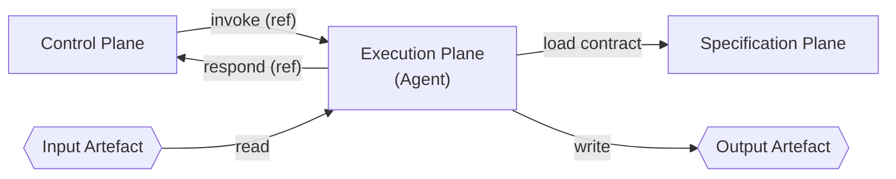

# The Agentic Workflow Framework

## Purpose of the Framework

Agentic work is most often coordinated by improvisation. As more work is handed to agents the same failure repeats: a single agent is given everything, loads all context, holds every responsibility, and reaches its goal by whatever means it can. It leaks across the boundaries between unrelated work and circumvents the ones beneath it. Nothing about it is repeatable, portable, or safe to trust, and none of it survives a change of contributor, tool, or scale.

The Agentic Workflow Framework is a standard to replace improvisation. It is a lightweight set of definitions, primitives, and rules that any team, project, or individual can adopt so that agentic work upholds a small set of values. It does this by giving the parts of an agentic system explicit boundaries: each agent has one identity and one purpose, and the parts stay decoupled so the system can be inspected, trusted, and changed a piece at a time.

Trust here is not extended to a black box. It is a property of a system whose boundaries are explicit, whose parts are inspectable, and whose behaviour is constrained rather than assumed.

### Values

- **Separation.** Every part has one job and a hard edge. Nothing leaks across the boundary between unrelated work, and nothing reaches underneath it.
- **Transparency.** The parts and their boundaries are visible and inspectable, never a black box.
- **Adaptability.** As the parts are separate and visible, any one of them can be changed or replaced on its own.
- **Context Discipline.** Just enough context, just in time. An agent loads the narrowest context  at the point of need, nothing speculative and nothing retained.

You separate so you can observe. You observe so you can adapt. The value is realised from the system, not the agent alone.

### Principles

A conformant adoption of the Framework upholds these properties:

- **Trustworthy.** Behaviour is constrained by explicitly defined boundaries, not assumed of a black box.
- **Consistent.** The same work produces the same behaviour every time it runs.
- **Repeatable.** Work can be run again, by another party, and hold.
- **Portable.** The way of working carries across people, environments, tools, and scale.
- **Modular.** Each part is managed in focus, on its own, without disturption to the rest.

The Framework is not a tool, not a workflow, and not a product. It is the shape that work takes when the parties involved have agreed to use the Framework.

The Framework is deliberately tool-agnostic. It defines what must exist and how the parts must relate. It does not define what the parts must be built out of. Implementations are free.

## Conformance
A tool, library, or service is Framework-conformant when it satisfies the must / must not rules for the primitive it implements.

Conformance exists to uphold the Values and Principles. The must / must not rules are how a primitive keeps its boundary intact, and intact boundaries are what make the work trustworthy, consistent, repeatable, portable, and modular. A primitive that honours its rules holds its edge; one that does not lets responsibility leak, and the values fail with it.

Swappability is the visible test of this. A conformant primitive can be replaced by another conformant implementation of the same primitive without rewiring the rest: change one part and the others are untouched, as each depends only on the others' boundaries, never their internals. If replacing one primitive forces a change in another, the implementation is not conformant.

Many existing tools conflate the responsibilities of multiple primitives; for example, by combining dispatch and procedure in a single artefact. Such tools are not Framework-conformant. They may still be useful, but they cannot interoperate with Framework-conformant implementations as drop-in replacements for any single primitive.

## The Primitives
The Framework defines four primitives. The first three are Planes; the fourth is the Artefact. Every adoption of the Framework instantiates all four.

### The Control Plane
The Control Plane dispatches Agents and carries signals. It is the only primitive that decides when an Agent is invoked and where its response is delivered.

It owns the workflow. The Control Plane holds the state machine for a Configuration: the order of invocations, the branches, and the conditions under which work advances, repeats, or returns to an earlier stage. Orchestration is its function and no other primitive holds it.

It owns the protocol. The Control Plane defines the communication contract with the Agent: the signals it emits, the responses it expects, and their format. It governs the shape of the exchange, never how the Agent does its work.

It performs no work, holds no procedure, and never opens an Artefact. It carries Artefact references as opaque data and dispatches an Agent by identity alone.

The Control Plane must:
- Accept an initiating input that starts a Workflow.
- Emit signals that carry, at a minimum, an Agent identity reference and an input Artefact reference.
- Decide which Agent to invoke next based on the state of the Workflow it is running.
- Receive Agent responses and act on them according to its own state and protocol.
- Carry Artefact references as opaque data.

The Control Plane must not:
- Carry an Artefact. It carries only references.
- Interpret or dereference an Artefact reference.
- Hold or interpret an Agent's procedure.
- Instruct an Agent on how to perform its role.
- Reference where the Agent resolves its contract.

### The Specification Plane
The Specification Plane holds and serves Agent contracts.

The Specification Plane is the only primitive that defines what an Agent is and how it does its work. It contains the specification for every Agent it serves. It does not dispatch work, manage state, or invoke Agents.

The Specification Plane must:
- Serve a contract for any Agent identity registered with it.
- Provide contracts in an addressable form.
- Implement the contract to the layers described in *Layered Context* (below).

The Specification Plane must not:
- Dispatch Agents.
- Hold runtime state.
- Depend on the implementation of the Control Plane.
- Hold the communication protocol. How an Agent is signalled and how it responds is the Control Plane's authority, not the contract's.

### The Execution Plane
The Execution Plane performs the work.

The Execution Plane is the only primitive that hosts and runs Agents. An **Agent** is the active runtime entity that, when invoked, loads its contract, reads input Artefacts, applies the procedure, writes output Artefacts, and responds. An Agent must be able to run correctly from cold: everything it needs is in its contract and the Artefacts it is given. A session may be kept warm while work continues on the same Artefact, but nothing may carry from one work item to the next.

An Agent resolves its contract from two inputs: the identity carried in the invocation, and the Specification Plane its host is bound to. The Control Plane supplies the identity at runtime. The binding to a Specification Plane source is a property of the Configuration, held by the Execution host, and established at deployment. The Framework does not define how that binding is realised; only that the host has one before any invocation arrives.

The Execution Plane must:
- Host Agents capable of being invoked by identity.
- Bind each Agent host to a Specification Plane source from which contracts are resolved by identity.
- Provide each Agent the ability to load its contract from the Specification Plane.
- Provide each Agent the ability to read and write Artefacts as defined in its contract.
- Emit response signals from Agents to the Control Plane per the Control Plane's protocol.

The Execution Plane must not:
- Let an Agent's correctness depend on state retained between invocations, or carry state from one work item into another.
- Bypass an Agent's contract.
- Mediate direct communication between Agents. Agents communicate with other Agents only through Control Plane invocations.

### The Artefact
The Artefact is the thing being worked on.

An Artefact is any addressable unit of state that an Agent reads as input or writes as output. Artefacts live outside the Framework's Planes, in durable storage the parties involved provide (a database row, a file, a record, a document, a message, anything addressable).

The Artefact must:
- Be addressable by a reference that can be carried in a signal.
- Have its shape, location, and access method defined in the relevant Agent's contract.

The Artefact must not:
- Travel inside the Control Plane. Only references travel.
- Be implicit. If an Agent reads or writes something, it is an Artefact with a defined shape.

#### Affordances

An output Artefact's contract may declare the **affordances** the Artefact must carry: the qualities its content must have so that anything downstream can use it. An affordance is stated as a property of the Artefact, never as a fact about its consumer.

> Correct: "The output must be evaluable without context outside this work item."
> Incorrect: "The next Agent in the chain reads this."

Affordances are how the Framework keeps work usable downstream without coupling an Agent to the identity of whatever consumes its output. The producing Agent learns what its output must support. It never learns who supports it. This preserves Agent isolation while keeping the chain coherent.

### Separation of the Primitives
The Control Plane and the Specification Plane are separate. They share no state, no storage, and no process. They may run in different locations. Their only shared dependency is the Agent identity carried in the invocation payload.

For the Framework to function, every Agent identity emitted by a Control Plane must resolve to a contract in the Specification Plane that the invoked Agent can reach. If it does not, the invocation fails.

This is the only requirement the Framework enforces between primitives. Meet it and all other choices are free.

## The Invocation Loop
Every Agent invocation follows the same sequence:

1. **Invoke.** The Control Plane signals an Agent on the Execution Plane with an identity and an input Artefact reference.
2. **Load contract.** The Agent loads its contract from the Specification Plane.
3. **Read input.** The Agent dereferences the input Artefact reference as its contract defines and reads the Artefact from where it lives.
4. **Perform work.** The Agent applies the procedure defined in its contract.
5. **Write output.** The Agent writes the output Artefact to where it belongs and obtains an output reference.
6. **Respond.** The Agent signals the Control Plane with the output reference.

The Control Plane carries signals and references. The Execution Plane runs the Agent that touches the Artefacts. The Specification Plane provides procedure. These responsibilities must never overlap.

## Layered Context

**Layered Context** is the Framework's approach to context: context for an Agent should be layered, addressable, and loaded on demand at the point of need, rather than pre-loaded as a single undifferentiated payload. This keeps each invocation's context narrow, makes behaviour predictable, and keeps resource usage manageable as the work scales.

The Framework takes a specific practice from this approach, folder-style addressing and layering of context, and applies it to the Specification Plane. It does not adopt any wider methodology wholesale. Every adoption of the Framework should structure its Specification Plane in the five layers below. A Specification Plane appropriately aligned to the Framework exposes all five layers as a single, version-controlled source of truth.

### The Layers
| Layer | Answers | Consumer |
|---|---|---|
| **L0** | Where am I? | Ambient context. Inherited by every Agent in the same scope upon invocation. |
| **L1** | Which contract is mine? | Resolution. How an Agent resolves its contract from the identity it was invoked with. |
| **L2** | What do I do? | Agent identity. The role the Agent assumes when invoked. |
| **L3** | What rules apply? | How the Agent performs its work with the given procedure, tools and references. |
| **L4** | What am I working with? | The artefact specification. Shape, rules, location and handling process of input and output artefacts. References to supporting resources to complete the work. |

### Consumption

The Specification Plane is the sole holder of the layered content. The Control Plane does not consume the layers; its routing and any in-flight state are configured independently. The Control Plane and the Specification Plane share no runtime state and meet only through the Agent identity carried in the invocation payload.

The Specification Plane should be version-controlled. Changes to it are changes to the scope's way of working and must be treated as such. They become a blueprint for repeatability and consistency.

### Hygiene

The Framework requires that the Specification Plane remain coherent. Specifically:

- An Agent must not load context it does not need.
- The layers must not contradict each other.
- Content repeated across multiple Agents' L3 should be elevated to a shared, referenced location.

Enforcement of hygiene is a responsibility of the adopting party. The Framework defines the rules; the implementation must check them.

## Workflows and Configurations

A **Workflow** is a named arrangement of Agents: which roles take part, and how their inputs and outputs are wired. A Workflow is abstract. It defines roles and wiring, not the running machinery beneath them.

A **Configuration** is a Workflow bound to concrete primitive instances: a specific Control Plane, a specific Execution Plane host, and the Specification Plane it pulls contracts from. The same Workflow can run as many Configurations, each binding the same roles and wiring to a different set of instances.

Workflows are the unit of design. Configurations are the unit of deployment. A Workflow runs as one or more Configurations.

### Workflow Definitions

A **Workflow Definition** is the durable, version-controlled encoding of a Workflow: the roles that take part and how their inputs and outputs are wired. The Workflow is the concept; the Workflow Definition is the durable encoding of it.

A Workflow Definition is Control Plane data. It is the arrangement a Control Plane realises as its state machine when it runs a Configuration. It is not a contract and it is not an Artefact, so a Control Plane loading its own Workflow Definition does not breach the separation of the primitives. How and when a Control Plane loads a Definition (at deployment, at runtime, by path, by request) is the adopting party's choice and not the Framework's concern.

A Workflow Definition may be stored in the Specification Plane, alongside the contracts of the roles it wires. This is permitted and encouraged, because co-locating the two makes the Framework's one enforced coupling checkable before runtime: every role a Definition names can be verified to resolve to a contract that sits beside it. Storing a Definition this way is a hygiene choice, not a Framework requirement, and it does not change what the Definition is. Even when it lives in the Specification Plane, it remains Control Plane data that the Control Plane reads as its own; it is never the Control Plane reading a contract.

The Framework does not require a Workflow Definition to live in any particular primitive. It requires only that the Control Plane treat it as its own configuration and never reach into the Specification Plane for a contract.

### Execution Profiles

A Configuration binds an Execution Plane host to a Specification Plane source. An **Execution Profile** declares what an Agent identity requires in order to wake correctly: the conditions the Execution Plane must satisfy before the Agent begins work. It may state a bootstrap entry point, required tools, permitted paths, runtime flags, environment expectations, and any other capability the runtime must provide.

The Execution Profile is a declarative part of the Specification Plane. The Specification Plane declares the conditions; it does not realise them. The Execution Plane reads the Profile and constructs a conformant runtime: selecting a runner, enabling tools, setting the working location, suppressing unwanted ambient context, or injecting the bootstrap into the invocation. The Profile is the conditions; the Configuration is the realisation of the selections that satisfy them.

An Execution Profile does not move the Control Plane boundary. The Control Plane still dispatches only an Agent identity and an input Artefact reference. It does not name the bootstrap, interpret tool requirements, configure the runtime, or instruct the Agent how to perform its role.

This keeps startup deterministic without making the Control Plane responsible for procedure. The Specification Plane declares what an Agent needs to wake correctly; the Execution Plane realises those needs; the Control Plane remains a dispatcher of identity and references.

An Execution Profile is not a sixth layer. It is the L3 content the Execution Plane reads to construct the runtime before the Agent begins work: the subset of an Agent's rules, tools, and runtime conditions that must be satisfied for it to wake correctly. The five layers remain the single source of truth; the Profile is a view onto them, not an addition to them.

### Reference Topologies

The Framework recognises the following reference topologies. These describe how Agents and Control Planes can be arranged within a Workflow. They are descriptive; adopting parties may compose their own.

| Topology | Definition |
|---|---|
| **One-shot** | One Agent, one invocation, no chaining. |
| **Linear workflow** | N Agents in sequence under one Control Plane. Each Agent's output becomes the next Agent's input. |
| **Fan-out** | One Control Plane dispatches N Agents in parallel. |
| **Shared procedure** | N Agents serve identical or overlapping roles and pull from the same contract, each working on a different input Artefact. |

### Composition Rules

The Control Plane and the Specification Plane have independent scopes. The Framework permits the following relationships:

- One Control Plane to one Agent.
- One Control Plane to many Agents.
- Many Control Planes to one Agent identity. Different Control Planes invoke the same role; each invocation is a fresh Agent that resolves the same contract from the Specification Plane.
- One Specification Plane to one Agent.
- One Specification Plane to many Agents (shared procedure).

A Configuration may use any combination of these relationships.

### Chaining

The output reference of one Workflow may become the input reference of another. Within a single Control Plane, its state machine dispatches the next step on receiving a response.

How a Configuration is triggered from outside its Control Plane (by another Control Plane, a watcher, a schedule) is not the Framework's concern. Every such trigger still resolves to a Control Plane invocation. The Framework requires only that each Configuration meets its intent, not how Configurations are chained together.

## Domains and Subdomains

The primitives, Workflows, and Configurations above describe how work is done. Domains and Subdomains describe where that work is scoped.

A **Domain** is a top-level category of agentic work. Three Domains are recognised by the Framework:

| Domain | Definition |
|---|---|
| **Personal** | Agentic work done by and for an individual. |
| **Development** | Agentic work that produces something new. |
| **Operations** | Agentic work performed inside or alongside something already running. |

A **Subdomain** is a scoped unit within a Domain. Subdomains are the level at which the Framework is instantiated. Every Subdomain has its own setup, its own boundaries, and its own ownership, and holds one or more Workflows.

A Subdomain is the body of work that shares one setting and one set of shared truths. "Setting" is the ambient context the work sits in: where it happens and what is always true there. "Shared truths" are the facts, rules, and resources the work relies on in common. Two pieces of work that share both belong to the same Subdomain. Two that share neither are separate Subdomains.

A Subdomain corresponds one-to-one with a Specification Plane: the setting and shared truths that define a Subdomain are exactly what its Specification Plane holds. This is why two pieces of work that need different settings or different shared truths are different Subdomains.

This is an engineering test, not a naming one. Before declaring a new Subdomain, ask whether the new work needs its own setting and its own shared truths. If it can run on the existing ones, it belongs to the Subdomain that already exists.

A Domain contains one or more Subdomains. Subdomains may overlap, nest, or invoke each other. The shape of the Subdomain map is determined by the parties adopting the Framework; the Framework does not prescribe it beyond the one-to-one rule above.
